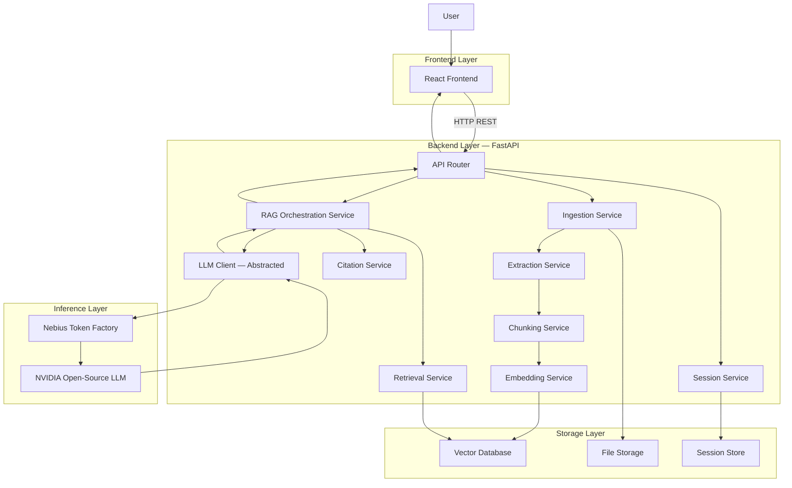
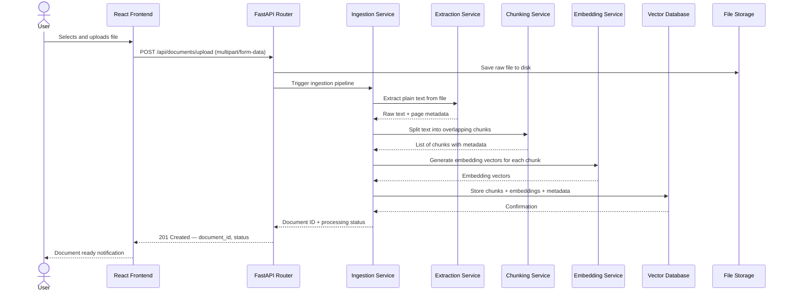
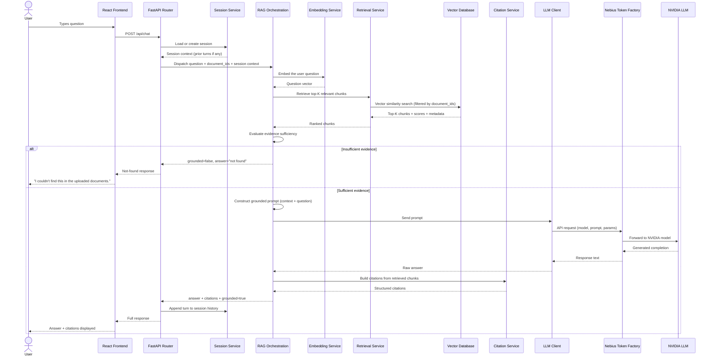
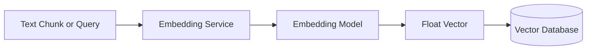
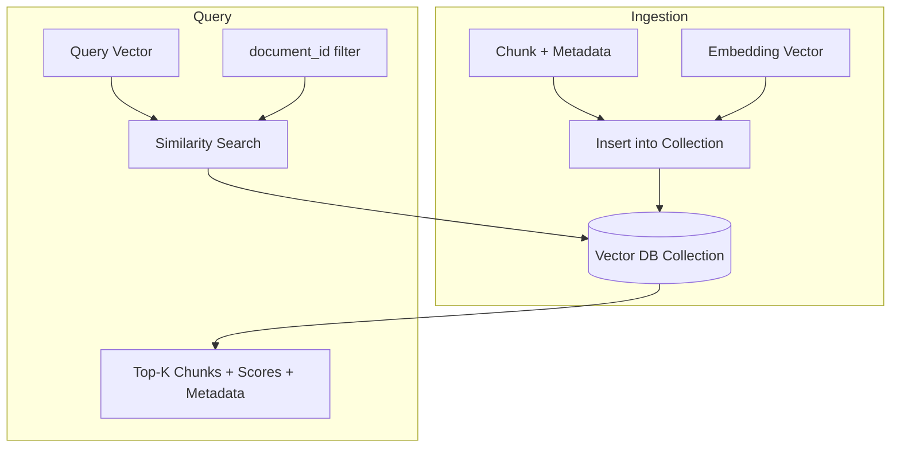
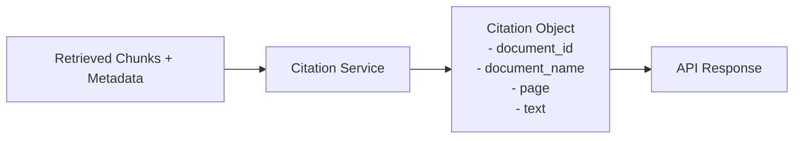
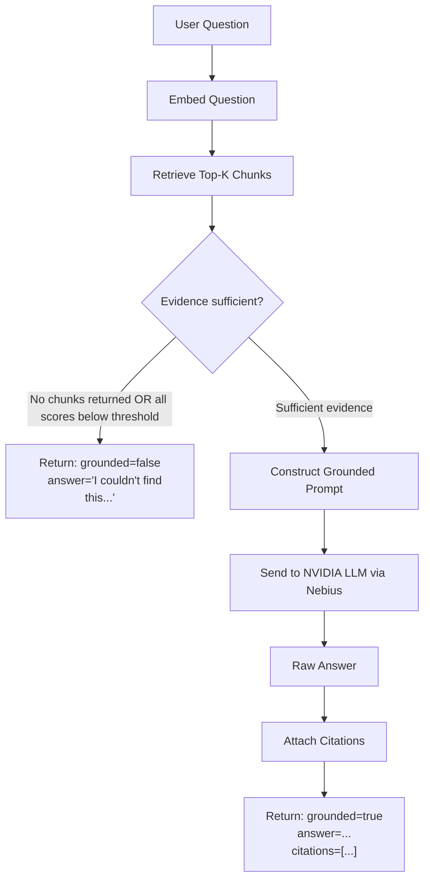

# NimDoc AI — System Architecture

> **Technical reference for the development team.**
> This document is the source of truth for architectural decisions, component responsibilities, and integration contracts.

---

## Table of Contents

1. [System Overview](#1-system-overview)
2. [High-Level Architecture Diagram](#2-high-level-architecture-diagram)
3. [Request Flow — Document Ingestion](#3-request-flow--document-ingestion)
4. [Request Flow — RAG Query](#4-request-flow--rag-query)
5. [Component Responsibilities](#5-component-responsibilities)
6. [Frontend / Backend Boundary](#6-frontend--backend-boundary)
7. [Backend / RAG Boundary](#7-backend--rag-boundary)
8. [Nebius Token Factory Integration](#8-nebius-token-factory-integration)
9. [NVIDIA Model Integration](#9-nvidia-model-integration)
10. [Embedding Flow](#10-embedding-flow)
11. [Vector Database Flow](#11-vector-database-flow)
12. [Citation Architecture](#12-citation-architecture)
13. [RAG Grounding Logic](#13-rag-grounding-logic)
14. [Error Handling](#14-error-handling)
15. [Security Considerations](#15-security-considerations)
16. [Configuration](#16-configuration)
17. [Scalability Considerations](#17-scalability-considerations)
18. [Repository Structure](#18-repository-structure)
19. [Technology Decisions](#19-technology-decisions)
20. [Open Decisions](#20-open-decisions)

---

## 1. System Overview

NimDoc AI is a private, document-grounded question-answering assistant built on a **Retrieval-Augmented Generation (RAG)** architecture.

**Core principle:** Every factual answer must be grounded in content retrieved from the user's uploaded documents. The system must never invent facts. When evidence is insufficient, it returns a clearly stated "not found" response.

**Architecture style:** Modular monolith. All backend services are implemented as Python modules within a single FastAPI application. This avoids microservice overhead during the hackathon MVP while maintaining clear separation of concerns. Services can be extracted independently if required later.

**Inference path:** The backend communicates with an NVIDIA open-source language model exclusively through the Nebius Token Factory API. This is the primary LLM inference path — not a fallback.

---

## 2. High-Level Architecture Diagram



---

## 3. Request Flow — Document Ingestion

This flow is triggered when a user uploads a document.



**Metadata attached to each chunk:**
- `document_id`
- `document_name`
- `page_number` (where available)
- `chunk_index`
- `character_offset`
- Raw chunk text (stored alongside the vector for citation retrieval)

---

## 4. Request Flow — RAG Query

This flow is triggered when a user asks a question.



---

## 5. Component Responsibilities

### 5.1 Frontend (owned by Frontend Developer)

| Component | Responsibility |
|---|---|
| Upload UI | File picker, drag-and-drop, upload progress |
| Document List | Show uploaded documents, status, delete button |
| Chat Interface | Question input, send button, session management |
| Answer Display | Render the answer text cleanly |
| Citation Display | Show document name, page, and quoted source text per citation |
| Loading States | Spinners/skeletons during upload and query processing |
| Error States | Display user-friendly error messages from API |

**Does not:** Communicate directly with the vector database, embedding service, or LLM. All communication is through the FastAPI backend REST API.

---

### 5.2 API Router (`app/api/`) (owned by Team Lead)

| File | Responsibility |
|---|---|
| `documents.py` | Routes for upload, list, get, delete document endpoints |
| `chat.py` | Routes for chat, session retrieval endpoints |

- Validates incoming requests using Pydantic models.
- Delegates all business logic to service modules.
- Returns structured JSON responses and correct HTTP status codes.
- Does not contain business logic directly.

---

### 5.3 Ingestion Service (`services/ingestion.py`) (owned by Team Lead / RAG Developer)

- Orchestrates the full ingestion pipeline for a single document.
- Calls extraction → chunking → embedding → vector store in sequence.
- Returns a `document_id` and processing status to the API router.
- Handles errors at each pipeline stage and reports them cleanly.

---

### 5.4 Extraction Service (`services/extraction.py`) (owned by RAG Developer)

- Accepts a file path (PDF or other supported type).
- Extracts plain text from the document.
- Returns text with page-level metadata where the format supports it.
- **Proposed library:** PyMuPDF (`fitz`) — supports page-level extraction.
- Must handle malformed or image-only PDFs gracefully (log warning, return empty extraction with error flag).

---

### 5.5 Chunking Service (`services/chunking.py`) (owned by RAG Developer)

- Accepts raw text + metadata from the extraction service.
- Splits text into overlapping chunks suitable for embedding.
- Chunk size and overlap are configurable via environment variables (`CHUNK_SIZE`, `CHUNK_OVERLAP`).
- Preserves metadata (`document_id`, `page_number`, `chunk_index`) per chunk.
- Returns a list of structured chunk objects.

**Default strategy (proposed):** Fixed-size token/character windowing with overlap. Alternative strategies (semantic chunking, sentence-based) can be introduced by the RAG Developer.

---

### 5.6 Embedding Service (`services/embedding.py`) (owned by RAG Developer)

- Accepts a list of text strings (chunks or a query).
- Returns a list of embedding vectors.
- The embedding model is configurable via `EMBEDDING_MODEL_NAME` environment variable.
- **Model to be finalized** by the RAG Developer.
- The service interface must not change when the embedding model changes.

---

### 5.7 Vector Database (`services/` + external DB) (owned by RAG Developer)

- Stores chunk vectors and their associated metadata.
- Supports:
  - Insert vectors with metadata payloads.
  - Similarity search with optional filtering by `document_id`.
  - Delete all vectors associated with a `document_id`.
- **Candidate options:** Qdrant, Chroma — to be finalized by RAG Developer.
- All vector DB interactions are encapsulated within `services/embedding.py` or a dedicated `services/vectorstore.py`. No other service accesses the vector DB directly.

---

### 5.8 Retrieval Service (`services/retrieval.py`) (owned by RAG Developer)

- Accepts: question embedding vector + list of `document_ids` + `top_k` parameter.
- Queries the vector database for the `top_k` most similar chunks.
- Filters results to only the specified `document_ids`.
- Returns a ranked list of chunks with their metadata and similarity scores.
- `top_k` is configurable via `TOP_K_RETRIEVAL` environment variable.

---

### 5.9 RAG Orchestration Service (`services/rag.py`) (owned by Team Lead / RAG Developer)

- Entry point for all query processing.
- Coordinates: embed question → retrieve chunks → evaluate evidence → construct prompt → call LLM → attach citations.
- **Evidence sufficiency evaluation:**
  - If no chunks are returned, or if all similarity scores fall below a configured threshold, mark as `grounded=false`.
  - Return a standard "not found" message without calling the LLM.
- **Prompt construction:**
  - Assembles retrieved chunks as numbered context blocks.
  - Appends the user question.
  - Applies the system prompt (see Section 13).
- Returns a structured `ChatResponse` object.

---

### 5.10 LLM Client (`services/llm.py`) (owned by RAG Developer)

- Provides a single method: `generate(prompt: str) → str`.
- Internally calls the Nebius Token Factory API using the configured model.
- Model name, API key, base URL, and generation parameters (temperature, max tokens) are all externalized to environment variables.
- Changing the LLM model requires only environment variable updates — not code changes.
- All Nebius-specific API logic is isolated in this file.

---

### 5.11 Citation Service (`services/citation.py`) (owned by Team Lead)

- Accepts a list of retrieved chunks.
- Constructs a structured `Citation` object for each chunk:
  - `document_id`
  - `document_name`
  - `page` (if available)
  - `text` (source chunk text)
- Returns a list of `Citation` objects to be included in the API response.

---

### 5.12 Session Service (`services/session.py`) (owned by Team Lead)

- Creates and loads chat sessions by `session_id`.
- Stores conversation turns (question + answer pairs) in session history.
- Session history can optionally be provided as prior context to the LLM for follow-up question support.
- **MVP storage:** In-memory dictionary (acceptable for hackathon scope).
- **Future:** Persist to a lightweight database (SQLite, Redis, or similar).

---

## 6. Frontend / Backend Boundary

```
React Frontend
      │
      │  HTTP REST (JSON)
      │  All communication through documented API endpoints
      │
FastAPI Backend (http://localhost:8000)
```

**Contract:**
- The frontend communicates exclusively via the REST API documented in [`docs/api.md`](api.md).
- The frontend does not import or directly call Python backend code.
- The frontend does not know about the vector database, embeddings, or the LLM.
- The API must return consistent error shapes so the frontend can handle all errors uniformly.

**Standard error response shape (all endpoints):**
```json
{
  "error": "human-readable error message",
  "code": "ERROR_CODE_CONSTANT"
}
```

---

## 7. Backend / RAG Boundary

The RAG pipeline is not a separate service — it is a set of Python modules within the same FastAPI backend. The boundary is logical, not network-level.

```
app/api/chat.py
      │
      │  calls
      ▼
app/services/rag.py   ← RAG orchestration
      │
      ├── services/embedding.py
      ├── services/retrieval.py
      ├── services/llm.py
      └── services/citation.py
```

**Owner boundary:**
- `app/api/` → Team Lead
- `app/services/rag.py`, `embedding.py`, `retrieval.py`, `llm.py` → RAG Developer
- `app/services/citation.py`, `session.py`, `ingestion.py` → Team Lead (with RAG Developer input)
- `app/services/extraction.py`, `chunking.py` → RAG Developer

Changes crossing the boundary require communication and a Pull Request.

---

## 8. Nebius Token Factory Integration

**Role:** Nebius Token Factory is the API gateway through which the backend accesses the NVIDIA open-source model. It abstracts direct GPU/compute management.

**Integration point:** `app/services/llm.py`

**Configuration (via environment variables):**

| Variable | Description |
|---|---|
| `NEBIUS_API_KEY` | Authentication token for Nebius Token Factory |
| `NEBIUS_API_BASE_URL` | Base URL of the Nebius Token Factory endpoint |
| `LLM_MODEL_NAME` | Model identifier string as expected by the Token Factory API |

**Request structure (conceptual):**
```
POST {NEBIUS_API_BASE_URL}/v1/chat/completions
Authorization: Bearer {NEBIUS_API_KEY}

{
  "model": "{LLM_MODEL_NAME}",
  "messages": [
    {"role": "system", "content": "<system prompt>"},
    {"role": "user",   "content": "<context + question>"}
  ],
  "temperature": 0.1,
  "max_tokens": 1024
}
```

> The exact API shape will be validated by the RAG Developer during Nebius onboarding. The `llm.py` service interface (`generate(prompt) → str`) must remain stable regardless of API shape changes.

**Low temperature is intentional** — factual Q&A requires deterministic, grounded outputs. The temperature is configurable but should default to a low value (e.g., `0.1`).

---

## 9. NVIDIA Model Integration

**Role:** An NVIDIA open-source LLM is the model that generates all answers.

**Model selection:** To be finalized by the RAG Developer based on:
- Context window size (larger = better for multi-chunk RAG)
- Instruction-following quality (critical for system-prompt compliance)
- Availability through Nebius Token Factory
- Inference latency requirements

**Model is configurable** via `LLM_MODEL_NAME`. No model name is hard-coded in application code.

**System prompt enforcement:** The NVIDIA model is instructed at inference time to:
- Answer only from the supplied document context.
- Not invent facts absent from the context.
- Return a "not found" statement if the context does not contain the answer.
- Preserve exact numbers, dates, names, requirements, and constraints.
- Cite sources by referring to numbered context blocks.

The system prompt is defined in `app/core/config.py` or a dedicated `app/core/prompts.py` module and loaded at startup.

---

## 10. Embedding Flow



**During ingestion:**
1. Each text chunk is passed to `embedding.py`.
2. The embedding service calls the configured embedding model.
3. The returned vector is stored in the vector database alongside the chunk text and metadata.

**During query:**
1. The user's question text is passed to `embedding.py`.
2. The returned query vector is used to search the vector database.

**Embedding model:** To be finalized by the RAG Developer. The model must:
- Be accessible (local or API-based).
- Produce vectors compatible with the chosen vector database.
- Be consistent between ingestion and query time (same model must be used for both).

**Important:** If the embedding model is changed, all previously stored vectors must be regenerated. This is a breaking change and requires a data migration.

---

## 11. Vector Database Flow



**Each stored record contains:**
```
{
  "id": "<chunk_uuid>",
  "vector": [0.123, -0.456, ...],
  "payload": {
    "document_id": "doc_123",
    "document_name": "project_guidelines.pdf",
    "page": 4,
    "chunk_index": 12,
    "text": "All projects must be submitted by October 15."
  }
}
```

**Deletion:** When a document is deleted via `DELETE /api/documents/{document_id}`, all vectors with that `document_id` in their payload must be removed from the vector database.

**Vector DB candidates:** Qdrant (preferred for production-like features), Chroma (simpler local setup). Decision owned by RAG Developer.

---

## 12. Citation Architecture

Citations are constructed by the Citation Service from the retrieved chunks — not extracted from the LLM's generated text.



**Why this approach:**
- Grounding citations in retrieved chunk metadata (not LLM output) guarantees citation accuracy.
- The LLM cannot hallucinate a citation because citations come from the retriever's structured metadata.
- The LLM's role is to synthesize an answer; the Citation Service independently records the sources.

**Citation object schema:**
```json
{
  "document_id": "doc_123",
  "document_name": "project_guidelines.pdf",
  "page": 4,
  "text": "All projects must be submitted by October 15."
}
```

All retrieved chunks that were used to construct the prompt are included as citations in the response, ranked by relevance score.

---

## 13. RAG Grounding Logic

This section defines the grounding decision logic in `services/rag.py`.



**Evidence sufficiency criteria (configurable):**
- At least one chunk is returned from the retriever.
- The highest similarity score exceeds a configured threshold (e.g., `MIN_RELEVANCE_SCORE`).

If either condition is not met, the LLM is **not called** and the "not found" response is returned directly.

**Grounded prompt structure:**

```
SYSTEM:
You are a document assistant. Answer questions strictly based on the provided document context.
Do not invent facts. If the answer is not in the context, say you could not find it.
Preserve exact numbers, dates, names, requirements, and constraints.

CONTEXT:
[1] (project_guidelines.pdf, Page 4)
"All projects must be submitted by October 15."

[2] (project_guidelines.pdf, Page 2)
"..."

QUESTION:
What is the submission deadline?
```

---

## 14. Error Handling

### Document Ingestion Errors

| Error | Handling |
|---|---|
| Unsupported file type | Return `400 Bad Request` immediately |
| File too large | Return `413 Request Entity Too Large` |
| PDF extraction failure (image-only PDF) | Return `422 Unprocessable Entity` with explanation |
| Embedding service failure | Return `500` with error logged; do not store partial data |
| Vector DB write failure | Return `500`; clean up any partially stored file |

### Query Errors

| Error | Handling |
|---|---|
| Empty question | Return `400 Bad Request` |
| Invalid `document_ids` (not found) | Return `404 Not Found` for the missing IDs |
| Retrieval returns no results | Return `grounded=false` with "not found" message (not an error) |
| Nebius API timeout | Return `504 Gateway Timeout` |
| Nebius API auth failure | Return `502 Bad Gateway` (do not expose the raw API key error) |
| LLM rate limit | Return `429 Too Many Requests` |

### Standard Error Response

All error responses share this shape:
```json
{
  "error": "Description of what went wrong.",
  "code": "EXTRACTION_FAILED"
}
```

HTTP status codes follow REST conventions. No sensitive internal details (stack traces, API keys) are ever returned to the client.

---

## 15. Security Considerations

> **MVP scope:** NimDoc AI does not include authentication in the MVP. The following items are noted for awareness.

| Concern | MVP Approach | Future Recommendation |
|---|---|---|
| API key protection | `NEBIUS_API_KEY` stored in `.env`, never committed to Git | Use a secrets manager (e.g., HashiCorp Vault, AWS Secrets Manager) |
| File upload validation | Validate MIME type and extension before processing | Add AV scanning for uploaded files |
| Upload size limits | Configurable `MAX_UPLOAD_SIZE_MB` enforced at API layer | CDN-level limits in production |
| No authentication | All endpoints are public in MVP | Add JWT/OAuth2 user authentication post-MVP |
| Document isolation | `document_ids` filtering in retriever prevents cross-document leakage | Add user-based access control post-MVP |
| `.env` not in Git | `.env` is in `.gitignore`; `.env.example` contains no real credentials | — |
| Dependency safety | `requirements.txt` should pin versions | Add `pip audit` or `safety` to CI |

**Critical:** The `.env` file containing `NEBIUS_API_KEY` must never be committed to the repository. Verify `.gitignore` before the first commit.

---

## 16. Configuration

All runtime configuration is managed through environment variables loaded at startup via `app/core/config.py` using Pydantic `BaseSettings`.

```python
# app/core/config.py (conceptual)
class Settings(BaseSettings):
    nebius_api_key: str
    nebius_api_base_url: str
    llm_model_name: str
    embedding_model_name: str
    vector_db_url: str
    vector_db_collection: str
    upload_dir: str = "./uploads"
    max_upload_size_mb: int = 50
    chunk_size: int = 512
    chunk_overlap: int = 64
    top_k_retrieval: int = 5
    min_relevance_score: float = 0.5
    log_level: str = "INFO"

    class Config:
        env_file = ".env"
```

No configuration values are hard-coded in service modules. Services receive their configuration via dependency injection from `app/core/dependencies.py`.

---

## 17. Scalability Considerations

> NimDoc AI is designed as a hackathon MVP. The following observations are for architectural awareness — premature optimization is not a goal.

| Dimension | MVP Approach | Scalability Path |
|---|---|---|
| Document processing | Synchronous, inline in request | Move to async task queue (Celery, RQ) |
| Session storage | In-memory dict | Replace with Redis or a database |
| Vector database | Single local instance | Qdrant supports distributed deployments |
| LLM inference | Single Nebius endpoint | Add retry logic, rate limit handling |
| File storage | Local filesystem | Replace with object storage (S3, GCS) |
| Backend | Single FastAPI process | Add Gunicorn workers; deploy behind a load balancer |
| Frontend | Single Vite dev server | Build static assets; deploy to CDN |

For the hackathon demo, a single-machine deployment running all components locally is entirely acceptable.

---

## 18. Repository Structure

```
nimdoc-ai/
│
├── frontend/
│   ├── src/
│   │   ├── components/         # Upload, Chat, CitationCard, DocumentList, etc.
│   │   ├── pages/
│   │   ├── hooks/
│   │   ├── services/           # axios/fetch wrappers for API calls
│   │   └── main.jsx
│   ├── index.html
│   └── package.json
│
├── backend/
│   ├── app/
│   │   ├── main.py             # FastAPI app creation, CORS, startup
│   │   ├── api/
│   │   │   ├── documents.py    # /api/documents routes
│   │   │   └── chat.py         # /api/chat routes
│   │   ├── services/
│   │   │   ├── ingestion.py    # Pipeline orchestration
│   │   │   ├── extraction.py   # PDF → text
│   │   │   ├── chunking.py     # Text → chunks
│   │   │   ├── embedding.py    # Text/chunks → vectors
│   │   │   ├── retrieval.py    # Vector DB query
│   │   │   ├── rag.py          # RAG orchestration
│   │   │   ├── llm.py          # Nebius/NVIDIA LLM client
│   │   │   ├── citation.py     # Citation construction
│   │   │   └── session.py      # Session management
│   │   ├── models/
│   │   │   ├── document.py     # DocumentMetadata, DocumentListItem, etc.
│   │   │   └── chat.py         # ChatRequest, ChatResponse, Citation, etc.
│   │   └── core/
│   │       ├── config.py       # Pydantic Settings
│   │       ├── dependencies.py # FastAPI dependency injection
│   │       └── prompts.py      # System prompt templates
│   └── requirements.txt
│
├── rag/
│   └── experiments/            # Notebooks, prompt experiments, eval scripts
│
├── tests/
│   ├── backend/
│   └── frontend/
│
├── docs/
│   ├── architecture.md         # This file
│   └── api.md
│
├── .env.example
├── .gitignore
└── README.md
```

---

## 19. Technology Decisions

| Decision | Choice | Status | Owner |
|---|---|---|---|
| Frontend framework | React + Vite | Proposed | Frontend Developer |
| Frontend styling | Tailwind CSS | Proposed | Frontend Developer |
| Backend framework | FastAPI (Python) | Confirmed | Team Lead |
| PDF extraction | PyMuPDF (`fitz`) | Proposed | RAG Developer |
| Chunking strategy | Fixed-size with overlap | Proposed | RAG Developer |
| Embedding model | TBD | **To be finalized** | RAG Developer |
| Vector database | Qdrant or Chroma | **To be finalized** | RAG Developer |
| LLM | NVIDIA open-source model | **To be finalized** | RAG Developer |
| LLM access | Nebius Token Factory | Confirmed | RAG Developer |
| Session storage | In-memory (MVP) | Confirmed | Team Lead |
| File storage | Local filesystem (MVP) | Confirmed | Team Lead |

---

## 20. Open Decisions

The following decisions are outstanding and must be resolved before implementation of their respective components begins. Each decision has a designated owner.

| Decision | Owner | Deadline | Notes |
|---|---|---|---|
| Embedding model selection | RAG Developer | Before embedding service implementation | Must be available via Nebius or locally |
| Vector database selection | RAG Developer | Before ingestion pipeline implementation | Qdrant or Chroma are the candidates |
| NVIDIA model name | RAG Developer | Before LLM service implementation | Verify availability on Nebius Token Factory |
| Exact Nebius Token Factory API shape | RAG Developer | Before LLM service implementation | Confirm auth headers, endpoint format |
| Chunking hyperparameters | RAG Developer | During RAG experimentation | `CHUNK_SIZE`, `CHUNK_OVERLAP` defaults |
| Retrieval threshold | RAG Developer | During RAG experimentation | `MIN_RELEVANCE_SCORE` default value |
| Session persistence strategy | Team Lead | Post-MVP or if time permits | In-memory is acceptable for the demo |

When a decision is finalized, the relevant team member updates this table and the [Technology Decisions](#19-technology-decisions) table above.

---

*NimDoc AI — System Architecture — Nebius × NVIDIA Global AI Hackathon*
